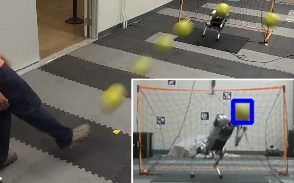
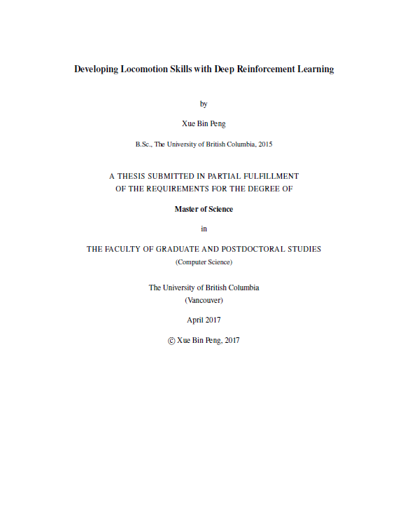

<h2>Publications</h2>

<b> &nbsp; &mdash; 2022 &mdash; </b>

<table border="0" cellpadding="3" cellspacing="10">
	<tr>
		<td></td>
		<td>
			<b>Creating a Dynamic Quadrupedal Robotic Goalkeeper with Reinforcement Learning</b>   
			Xiaoyu Huang, Zhongyu Li, Yanzhen Xiang, Yiming Ni, Yufeng Chi, Yunhao Li, Lizhi Yang, <b>Xue Bin Peng</b>, and Koushil Sreenath  
			<em> arXiv Preprint 2022 </em>   
			[<a href="projects/A1Goalkeeping/index.html">Project page</a>] [<a href="projects/A1Goalkeeping/2022_A1Goalkeeping.pdf">Paper</a>]
		</td>
	</tr>

</table>

<b>&nbsp; &mdash; 2021 &mdash; </b>

<table border="0" cellpadding="3" cellspacing="10">

</table>

<b>&nbsp; &mdash; 2020 &mdash; </b>

<table border="0" cellpadding="3" cellspacing="10">

</table>

<b>&nbsp; &mdash; 2019 &mdash; </b>

<table border="0" cellpadding="3" cellspacing="10">

</table>

<b>&nbsp; &mdash; 2018 &mdash; </b>

<table border="0" cellpadding="3" cellspacing="10">

</table>

<b>&nbsp; &mdash; 2017 &mdash; </b>

<table border="0" cellpadding="3" cellspacing="10">

</table>

<b>&nbsp; &mdash; 2016 &mdash; </b>

<table border="0" cellpadding="3" cellspacing="10">

</table>

<b>&nbsp; &mdash; 2015 &mdash; </b>

<table border="0" cellpadding="3" cellspacing="10">

</table>

   

<h2>Thesis</h2>

<table border="0" cellpadding="3" cellspacing="10">

	<tr>
		<td></td>
		<td>
			<b>M.Sc. Thesis</b>   
			<b>Developing Locomotion Skills with Deep Reinforcement Learning</b>   
			<em> University of British Columbia 2017 </em>   
			[<a href="projects/MSc_Thesis/index.html">Project page</a>] [<a href="projects/MSc_Thesis/MSc_Thesis.pdf">Thesis</a>]
		</td>
	</tr>
</table>